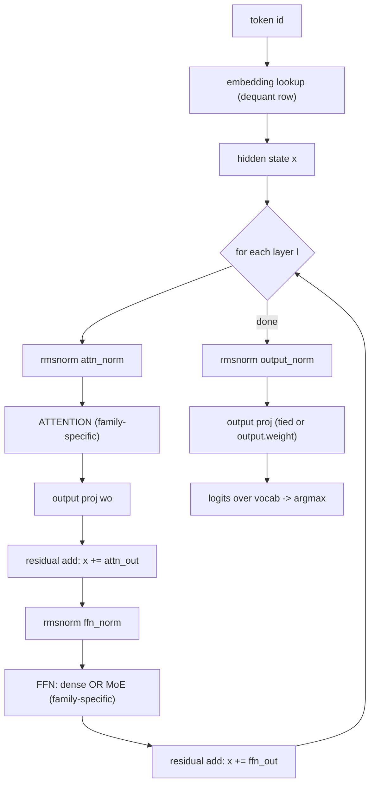
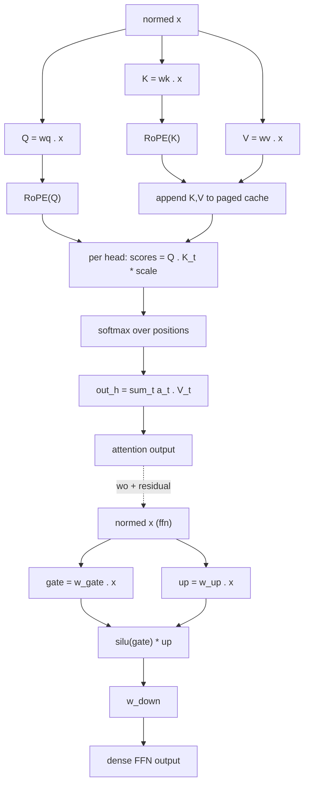
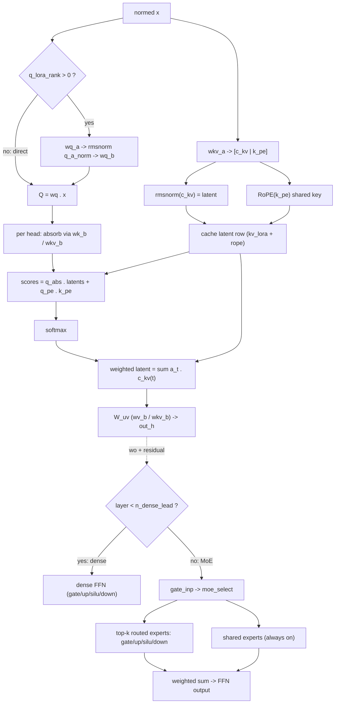
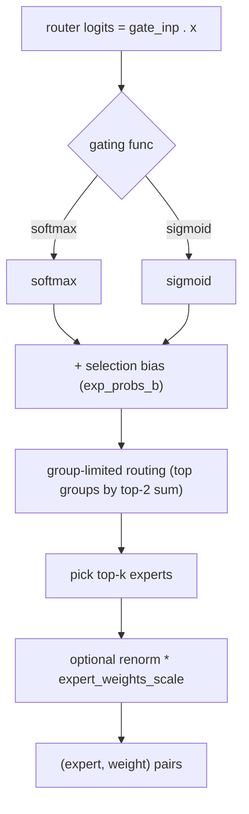
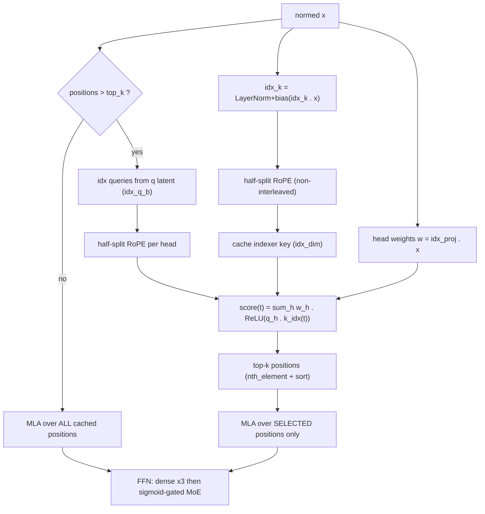

# Test-model architectures and information flow

Information-flow diagrams for every model under `tests/models/`.
The six model files map onto three architecture families the
runtime implements (`src/locus/model/arch.cpp`): `llama`,
`deepseek2`, and `glm-dsa`. Diagrams are per family; the
inventory below maps each file to its family and the spec that
drives its forward pass.

## 1. Inventory

| Model file            | Arch      | Quant  | Layers    | Attn        | FFN            |
|-----------------------|-----------|--------|-----------|-------------|----------------|
| stories260K           | llama     | F32    | 5         | MHA 8       | dense          |
| llama-3.2-1b-q8_0     | llama     | Q8_0   | 16        | GQA 32/8    | dense          |
| llama-3.2-1b-q4_k_m   | llama     | Q4_K_M | 16        | GQA 32/8    | dense          |
| deepseek-v2-lite      | deepseek2 | Q4_K_M | 27        | MLA 16      | 1d, MoE 64/6+2s |
| moonlight-16b-a3b     | deepseek2 | Q4_K_M | 27        | MLA 16/1    | 1d, MoE 64/6+2s |
| glm-5.2-iq1s          | glm-dsa   | IQ1_S  | 79 (78+1) | MLA+DSA 64/1 | 3d, MoE 256/8+1s |

Attn column: MHA/GQA/MLA with `heads` or `heads/kv_heads`. FFN
column: `Nd` = N leading dense layers, `MoE E/U+Ss` = E experts,
U routed per token, S always-on shared experts.

Key differences that change the diagrams:

- llama uses materialized-KV attention (MHA or GQA); deepseek2
  and glm-dsa use MLA latent attention (one compressed row per
  token in the cache).
- deepseek-v2-lite gates experts with softmax; moonlight and
  GLM-5.2 gate with sigmoid + group-limited routing.
- Only glm-dsa runs the DSA lightning indexer; the trailing MTP
  block (layer 78) is loaded but excluded from the causal stack,
  matching llama.cpp.

## 2. Shared forward skeleton

Every model is the same outer loop; the family only changes what
happens inside the Attention and FFN blocks.



## 3. llama family

Models: stories260K, llama-3.2-1b (Q8_0 and Q4_K_M).
Dense FFN; attention is multi-head, with grouped KV (GQA) when
`head_count_kv < head_count` (llama-3.2 is 32/8, stories260K is
8/8 = plain MHA). RoPE is the interleaved-pair variant; llama-3.2
carries a large rope base (500000) and optional llama3 scaling
divisors.



## 4. deepseek2 family (MLA + DeepSeek MoE)

Models: deepseek-v2-lite, moonlight-16b-a3b. MLA weight-absorbed
attention caches one latent row (rms-normed compressed KV plus a
shared roped key) per token instead of full K/V heads. FFN is
dense for the leading layer(s) then DeepSeek MoE (routed experts
+ always-on shared experts). deepseek-v2-lite uses softmax
gating; moonlight uses sigmoid gating.



MoE routing (`moe_select`, shared by CPU and GPU):



## 5. glm-dsa (MLA + DeepSeek MoE + DSA indexer)

Model: GLM-5.2 (744B, UD-IQ1_S). Computationally the deepseek2
stack (MLA + q_lora + split k_b/v_b, sigmoid gating, 256 experts
/ 8 used / 1 shared, 3 dense-lead layers, rope base 8e6) with one
addition: the DSA lightning indexer selects which cached
positions MLA attends. Below `indexer.top_k` (2048) positions the
selection keeps everything and the layer is identical to dense
MLA (this is what the llama.cpp golden anchors); beyond it, only
the top-k scored positions are attended. The trailing MTP block
(layer 78) is excluded from the causal stack.



## 6. Attention families at a glance

```
llama (MHA/GQA)      deepseek2 / glm-dsa (MLA)
-----------------    -------------------------------
cache: K,V per head  cache: 1 latent row per token
  (kv_heads * head_    (kv_lora + rope; glm-dsa adds
   dim, 2 tensors)      idx_dim for the indexer key)
scores: Q . K        scores: absorbed q . latents
                       + q_pe . k_pe
value: sum a . V     value: W_uv (sum a . c_kv)
select: all past     select: all past (deepseek2) or
                       DSA top-k (glm-dsa > top_k)
```

## 7. Where the diagrams live in code

| Stage                | Source                                        |
|----------------------|-----------------------------------------------|
| outer forward loop   | `LlamaModel::forward` (llama.cpp)             |
| llama attention      | `llama_attention` (arch.cpp)                  |
| MLA attention core   | `mla_attention` (arch.cpp)                    |
| deepseek2 attention  | `deepseek2_attention` -> mla_attention        |
| glm-dsa attention    | `glm_dsa_attention` (indexer + mla_attention) |
| dense / MoE FFN      | `LlamaModel::forward` / `moe_ffn` (llama.cpp) |
| expert routing       | `moe_select` (llama.cpp)                       |
