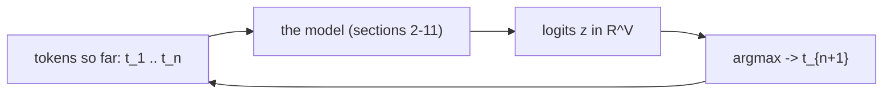
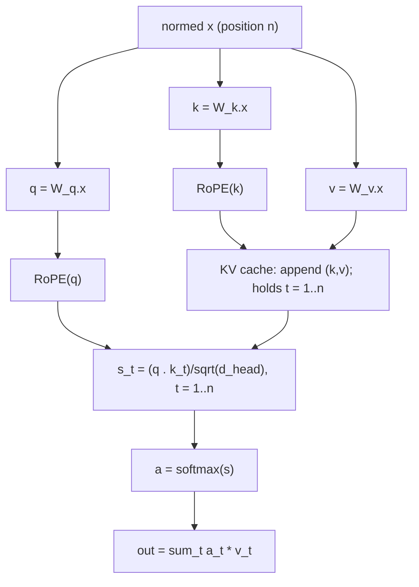
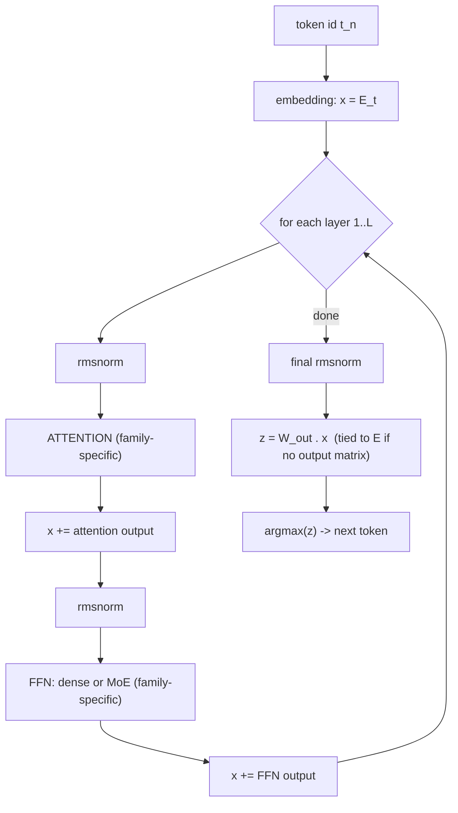
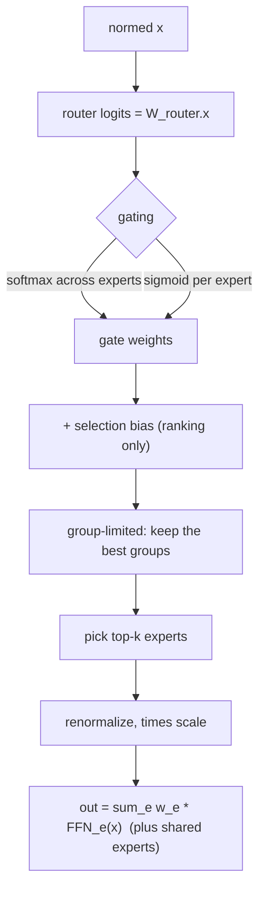
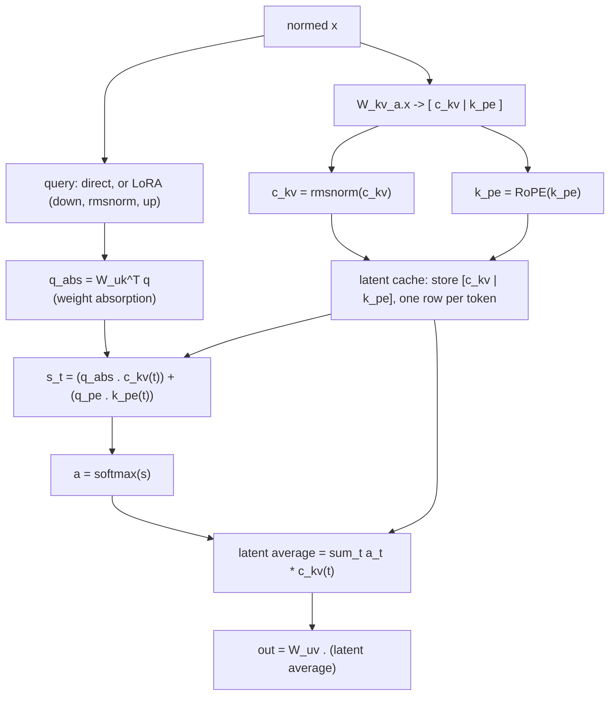
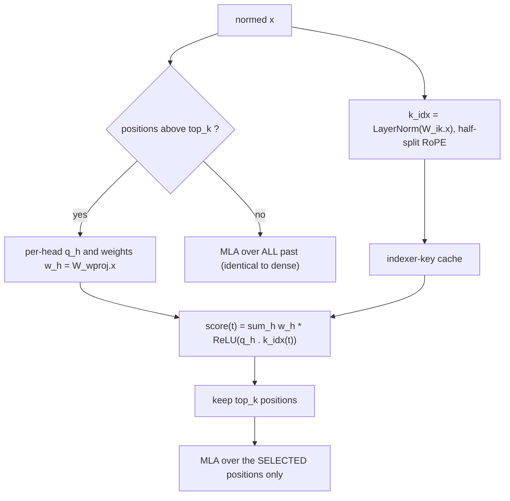

# How the models work: a linear-algebra walkthrough

This document explains, from the ground up, the machine that every
model file under `tests/models/` runs. It is written for a reader
who is comfortable with vectors, matrices, and dot products but has
never studied neural networks or AI. Read it top to bottom: each
section uses only ideas introduced before it. The last sections
list the actual model files, now that every term in them has a
meaning, and point to where each idea lives in the code.

Acronyms are spelled out the first time they appear (and again when
reintroduced far from their definition); a full table is in the
final "Acronyms" section.

Notation used throughout:

- Lowercase `x in R^d` is a column vector of `d` real numbers.
- Uppercase `W in R^{m x n}` is a matrix (`m` rows, `n` columns).
- `W.x` is the matrix-vector product (result in `R^m`).
- `<a,b> = sum_i a_i b_i` is the dot product of two vectors.
- `a * b` is elementwise multiplication; `c*x` is scalar times
  vector.
- A "token" is one chunk of input text (a word or word-piece)
  identified by an integer id. The "sequence" is the tokens seen so
  far; a token's "position" is its index in the sequence.

In diagrams the dot product is written `q . k` (not `<q,k>`), to
keep the diagram renderer happy.

A note on the word "learned." This document describes inference:
running a model whose training is already finished, which is what
locus does. Every matrix below -- the projections `W_*` and the
embedding `E` -- is a fixed table of numbers (its weights, or
parameters) produced by a separate training process we do not cover.
So "learned" here just means "a constant that training settled on";
while locus runs, none of these tables change.

## 1. What the model computes

A language model is a function from a sequence of tokens to a
prediction of the next token.

Tokenization -- how text becomes tokens. The models here use
byte-pair encoding (BPE). A fixed vocabulary of about 150,000 tokens
is built once, before training, and then reused unchanged. It is
grown by merging: start with an alphabet of the 256 single bytes (so
any text at all is expressible), scan a large corpus, repeatedly find
the most frequent adjacent pair of existing tokens, and add that pair
as a new token -- recording each merge and the order (its "rank") in
which it was added. After about 150,000 merges the vocabulary is
frozen.

To tokenize a new string at run time, locus (a) splits it into rough
chunks with a fixed regular expression -- which decides, for example,
that a leading space stays attached to the following word and that
runs of digits break apart; (b) turns each chunk into its raw bytes;
then (c) greedily re-applies the learned merges in rank order until
none fits. The surviving pieces are the tokens, and a token's integer
id is simply its row number in the vocabulary. Frequent words collapse
to a single token, rare words fall back to a few sub-word pieces, and
in the worst case to individual bytes -- so there is never an
"unknown" token. A special begin-of-sequence marker is usually
prepended. From here on the model sees only these integer ids, never
characters. (Code: `src/locus/tok/bpe_tokenizer.cpp`.)

Its output is a vector `z in R^V` of scores called logits, one per
vocabulary entry. To turn scores into an actual next token we use
greedy decoding: pick the id with the largest score, `argmax_i z_i`.
(One could instead sample randomly with probabilities proportional
to `exp(z)`, but the tests use greedy decoding because it is
deterministic and reproducible.)

Generation is autoregressive: predict the next token, append it to
the sequence, and repeat.

Everything that follows is the inside of the "model" box: how the
tokens `t_1 .. t_n` become the score vector `z`.

## 2. From token ids to vectors: embeddings and the residual stream

A token id is just an index; on its own it has no geometry, no
notion of "close to" or "far from" another token. The first step
gives each id a vector, by a plain table lookup. The model holds an
embedding matrix `E in R^{V x d}` -- one of its fixed weight tables,
with one row per vocabulary entry. Token id `t` selects row `t` of
`E`, the vector `E_t in R^d`. That is the whole operation: an index
into a table. (Equivalently it is `E^T` times the "one-hot" vector
that is 1 in position `t` and 0 elsewhere, but it is implemented as a
direct row read -- and dequantized to floats first if `E` is stored
compressed, Section 11.) The number `d` (2048 to 6144 in our models)
is the model dimension, also called the hidden size.

The rows of `E` are not arbitrary: training arranges them so that ids
occurring in similar contexts get nearby vectors, and that geometry is
what the rest of the network operates on. For locus, which only runs
the finished model, the rows are simply constants read out per token.

From here the model transforms one vector `x in R^d` per position
through a stack of `L` identical layers. This running vector is
called the residual stream. Each layer reads `x`, computes a
correction, and adds it back:

    x  <-  x + correction

Because every update is additive, a layer is "the identity plus a
learned perturbation." That additive structure is what lets the
stack be dozens of layers deep without the signal blowing up or
fading to zero as it passes through.

At the very end, the final `x` is turned back into vocabulary
logits (Section 7).

## 3. Keeping numbers in range: normalization

As corrections accumulate, the magnitude of `x` could drift. So
before each layer uses `x`, it normalizes a copy. The models use
RMSNorm (Root-Mean-Square Normalization):

    rmsnorm(x)_i  =  x_i / sqrt( (1/d) * sum_j x_j^2  +  eps )  *  g_i

It divides every entry by the root-mean-square of the vector
(making it unit length in the RMS sense), then multiplies
elementwise by a gain vector `g`. The term `eps` (epsilon) is a tiny
constant so the division stays safe when `x` is near zero.

Where `g` comes from: it is a learned weight vector of length `d`,
one number per hidden dimension, stored in the model file alongside
the layer -- there is a separate `g` for each normalization site
(the attention norm, the feed-forward norm, and the final output
norm carry their own, as `blk.N.attn_norm.weight`,
`blk.N.ffn_norm.weight`, `output_norm.weight`). Like every weight it
is fixed at inference; it lets training decide how much each of the
`d` coordinates should count after the vector has been rescaled to
unit RMS.

RMSNorm does not subtract the mean. The older and more common
LayerNorm (Layer Normalization) does: it centers `x` (subtracts its
mean) and then scales. One component of the GLM model uses LayerNorm
(Section 10); everywhere else these models use RMSNorm.

## 4. The one operation everything is built from: the linear layer

Nearly every learned transformation below is a matrix times a
vector, `y = W.x`. This "matvec" (matrix-vector product) is more
than 95% of the arithmetic the model does. The entries of `W` are
learned numbers called weights; when a model is said to have "744
billion parameters," it means its `W` matrices together hold that
many numbers.

Two shapes recur:

- a down-projection `W in R^{r x d}` with `r < d`: compress a vector
  into a smaller `r`-dimensional space.
- an up-projection `W in R^{d x r}`: expand back to `d`.

Chaining a down- then an up-projection, `W_up.(W_down.x)`, routes a
large `d x d` transformation through a thin `r`-dimensional
bottleneck, using far fewer parameters than a full `d x d` matrix.
This low-rank factorization idea returns twice later (query
compression and the MLA latent, Sections 8-9). Keep it in mind.

## 5. Attention: letting positions talk to each other

So far each position is processed alone. Attention is the only
operation that mixes information across positions -- it is how a
pronoun reaches its antecedent, or how a fact stated early informs
an answer produced late. We build it up piece by piece.

### 5.1 Queries, keys, values

From each position's normalized vector `x`, three separate linear
layers (Section 4) produce three vectors:

- query  `q = W_q.x`  -- "what am I looking for"
- key    `k = W_k.x`  -- "what do I offer to others"
- value  `v = W_v.x`  -- "what I will contribute if selected"

### 5.2 Scores and the weighted average

The position we are computing (the query, at position `n`) compares
itself against every earlier position `t` by a dot product, scaled:

    s_t  =  <q_n, k_t> / sqrt(d_head)

The division by `sqrt(d_head)` (the per-head dimension, Section 5.5)
keeps the scores from growing just because the vectors are
high-dimensional. The scores become weights through the softmax
function:

    a_t  =  exp(s_t) / sum_{t'} exp(s_{t'})

The `a_t` are nonnegative and sum to 1 -- a probability distribution
over earlier positions. The head's output is the weighted average of
those positions' values:

    out  =  sum_t a_t * v_t

So each position pulls in a blend of earlier values, weighted by how
well its query matches each earlier key.

### 5.3 Causal: only the past

The index `t` ranges only over positions `<= n`: a position may
attend to itself and to earlier tokens, never to future ones. This
is what makes left-to-right generation self-consistent -- the
prediction at position `n` cannot depend on tokens not yet produced.

### 5.4 The KV cache

To score position `n` we need the keys and values of all earlier
positions. Those never change once computed, so we store them. The
KV cache (Key/Value cache) holds every past `k_t` and `v_t`.
Generating one new token then costs: compute its single new `(k,v)`,
append to the cache, and read the whole cache. Without the cache we
would recompute all earlier keys and values at every step. (In
locus this cache is stored in fixed-size blocks called pages -- a
"paged KV cache" -- so many independent sequences can share one pool
of memory and common prefixes need not be duplicated.)

### 5.5 Multiple heads: MHA

A single query-key comparison can track one kind of relationship.
Multi-Head Attention (MHA) runs `h` of them in parallel: the
projections are split into `h` independent heads, each with its own
`d_head`-dimensional query, key, and value (with `h * d_head = d`).
Each head does Sections 5.1-5.2 in its own subspace, and the `h`
outputs are concatenated back into an `R^d` vector. Different heads
specialize in different relationships.

### 5.6 Sharing keys and values: GQA

The KV cache stores `h` keys and `h` values per position -- the
dominant memory cost at long context. GQA (Grouped-Query Attention)
reduces it: keep all `h` query heads, but let groups of query heads
share a single key/value head, so the cache holds only `h_kv < h`
keys and values per token. Our `llama-3.2-1b` uses 32 query heads
over 8 KV heads (4:1 sharing); `stories260K` uses 8 over 8, i.e. no
sharing, which is plain MHA. The quality cost is small and the cache
shrinks by the sharing factor.

### 5.7 Where does position come from? RoPE

Nothing above depends on WHERE a token sits: dot products do not
care about order. Position must be injected deliberately. RoPE
(Rotary Position Embedding) does it by rotation. Take the query and
key in two-dimensional coordinate pairs and rotate each pair by an
angle proportional to (position index) times (a per-pair frequency).
Writing `R(theta)` for the 2x2 rotation matrix, the query at
position `n` is rotated by `R(n*f)` and the key at position `t` by
`R(t*f)`. Their dot product then depends on

    R(n*f)^T R(t*f)  =  R((t-n)*f)

-- a function of the RELATIVE offset `t - n` only. So attention
automatically perceives relative distance, with no extra inputs.

The pairing of coordinates has two conventions:

- interleaved: pair adjacent dimensions `(2i, 2i+1)`. The llama
  models use this.
- half-split: pair `(i, i+d/2)`. The GLM indexer (Section 10) uses
  this.

The math is identical; only the bookkeeping differs, and each model
must use the convention it was trained with. A "rope base" (for
example 500000) sets the spread of frequencies: a larger base gives
longer wavelengths and supports longer contexts.

Putting one head together:

## 6. The other half of a layer: the feed-forward network

Attention mixes across positions; the second sublayer transforms
each position on its own. It is a feed-forward network (FFN), also
called an MLP (Multi-Layer Perceptron). Our models use the gated
variant SwiGLU (Swish-Gated Linear Unit):

    FFN(x)  =  W_down . ( silu(W_gate . x) * (W_up . x) )

Two up-projections widen `x` to a larger inner dimension (`W_gate`
and `W_up`), an elementwise gate multiplies them, and a
down-projection returns to `R^d`. The nonlinearity `silu` (Sigmoid
Linear Unit, `silu(z) = z * sigmoid(z)`) is a smooth curve; the
"gate" term `silu(W_gate.x)` modulates the "up" term elementwise
before the down-projection. Without a nonlinearity the whole stack
would collapse to a single linear map, so this is where the model's
expressive power beyond linear algebra enters. The FFN runs
identically and independently at every position.

## 7. A complete layer and the output: the "llama" family

We now have both sublayers. One layer is:

    x  <-  x + Attention( rmsnorm(x) )     (mix across positions)
    x  <-  x + FFN( rmsnorm(x) )           (transform each position)

Note the normalization before each sublayer and the residual add
around it (this "pre-norm" arrangement is what Sections 2-3 set up).
Stack `L` such layers. After the last one, a final RMSNorm and one
more linear map produce the logits:

    z  =  W_out . rmsnorm(x)     in R^V

Often `W_out` is not stored separately: tied embeddings reuse the
embedding matrix, `W_out = E`, so `z_t = <E_t, x>` scores the final
state against every vocabulary vector. Then `argmax(z)` is the
predicted token.

This complete machine -- embeddings, then `L` layers of
{MHA-or-GQA attention with RoPE, SwiGLU FFN}, then a final norm and
output projection -- is the llama family, the simplest of the three
in `tests/models/`. Our `stories260K` (a tiny 5-layer test network)
and `llama-3.2-1b` (16 layers) are exactly this.

The full forward pass, drawn once. Only the two boxes marked
"family-specific" differ between the three families; everything
else is shared.

The other two families each change exactly one of those boxes: the
FFN becomes a Mixture of Experts (Section 8), and ATTENTION becomes
latent (Section 9) and then sparse (Section 10).

## 8. More capacity without more compute: Mixture of Experts (MoE)

A dense FFN applies the same `W_gate`/`W_up`/`W_down` to every
token. A Mixture of Experts (MoE) layer instead keeps `E` separate
FFNs, called experts, and uses only a few per token. A small linear
router scores the experts, and a top-k selection decides which
actually run. This decouples the parameter count from the
per-token cost: `E` can be large (64, or 256) while only `k`
experts (6, or 8) execute for any given token. The model stores a
great deal but computes with little at a time.

The selection procedure (the `moe_select` routine in the code):

- router logits `r = W_router . x in R^E`: one score per expert.
- turn scores into gate weights, one of two ways: softmax across all
  experts (they compete for a shared budget -- `deepseek-v2-lite`),
  or sigmoid on each expert independently (`moonlight`, `GLM`).
- an optional per-expert selection bias is added for the RANKING
  only, not for the output weights.
- group-limited routing (larger models): the `E` experts are split
  into groups; only the few best groups survive (ranked by the sum
  of each group's top-2 scores), and selection happens within them.
  This bounds how many groups a token touches -- and, when weights
  are streamed from disk, how many bytes are read per token.
- pick the top-k experts; optionally renormalize their weights to
  sum to 1 and multiply by a constant.
- output = `sum over chosen experts  w_e * FFN_e(x)`.

Two further details our models use:

- shared experts: a small number of experts that run for EVERY token
  (handling common computation), added on top of the routed ones.
- leading dense layers: the first `n` layers are ordinary dense FFNs
  and only later layers route (`n = 1` for deepseek/moonlight, `3`
  for GLM). The earliest layers seem to benefit from full mixing.

`deepseek-v2-lite` and `moonlight` are the llama skeleton with this
MoE feed-forward and the latent attention of the next section.

## 9. Shrinking the KV cache: Multi-head Latent Attention (MLA)

Recall from Sections 5.4 and 5.6 that the KV cache -- `h_kv` keys
and values per token -- is the memory bottleneck. Multi-head Latent
Attention (MLA) shrinks it to ONE small vector per token, using the
low-rank factorization from Section 4.

Instead of storing per-head keys and values, MLA stores a single
compressed latent `c_kv in R^r` (`r = kv_lora`, 512 in our models),
produced by a down-projection of `x`, plus one shared rotary key
`k_pe`. The trick that keeps attention correct without ever
rebuilding per-head keys is weight absorption -- a plain algebraic
identity:

    <q, W_uk c>  =  <W_uk^T q, c>

Here `W_uk` is the up-projection that would reconstruct a head's key
from the latent. Rather than reconstruct the key (left side), we
fold `W_uk` into the query once (right side): precompute
`q_abs = W_uk^T q` and dot it directly against the stored latent
`c_kv`. The value side works symmetrically, with an up-projection
`W_uv` applied AFTER the weighted average, so values are never
materialized per token either:

    out_head  =  W_uv . ( sum_t a_t * c_kv(t) )

The score has two parts: the compressed part `<q_abs, c_kv>` plus a
rotary part `<q_pe, k_pe>` that carries position. (RoPE lives on its
own small slice, because a position-dependent rotation cannot be
folded into a static matrix the way `W_uk` was.)

MLA also compresses the query path itself with the same low-rank
factorization, here called a LoRA (Low-Rank Adaptation):
`x -> W_q_a` (down to a small rank) `-> rmsnorm -> W_q_b` (up). GLM
uses this query compression; the smaller models project the query
directly.

The net effect: the cache is one `r`-vector per token instead of
`2 * h_kv * d_head` numbers -- roughly an order of magnitude smaller
-- at the price of a little extra arithmetic (the absorptions). This
is the deepseek2 family: MLA attention with an MoE feed-forward.

## 10. Long context cheaply: the DSA sparse-attention indexer

Attention over all past positions costs work proportional to `n` at
position `n` -- fine for short text, expensive at tens of thousands
of tokens. GLM-5.2 adds DSA (DeepSeek Sparse Attention), a
"lightning indexer" that, past a cutoff, lets each query attend to
only the `top_k` most relevant earlier positions instead of all of
them.

A cheap secondary scorer runs before the main MLA attention:

- each position caches a small indexer key
  `k_idx = LayerNorm(W_ik . x)` -- this is the one place LayerNorm
  (mean-centered, Section 3) is used, followed by RoPE in the
  half-split convention.
- the query builds per-head indexer queries `q_h` (from the same
  query latent as MLA) and a set of per-head scalar weights
  `w_h = W_wproj . x`.
- earlier position `t` gets a relevance score

      score(t)  =  sum_h  w_h * ReLU( <q_h, k_idx(t)> )

  a head-weighted sum of rectified query-key similarities. ReLU
  (Rectified Linear Unit, `ReLU(z) = max(0, z)`) zeroes out heads
  that correlate negatively.
- keep the `top_k` highest-scoring positions; MLA then attends only
  those.

Below `top_k` positions (2048), "keep the top_k" keeps everything,
so the layer is exactly the dense MLA of Section 9. That is why a
short-prompt run can validate the entire code path against a
reference implementation. Above `top_k`, the cost is proportional to
`top_k` rather than `n`.

One loading detail: GLM ships an extra trailing block for MTP
(Multi-Token Prediction) -- a head trained to guess the
token-after-next, used to accelerate decoding in other systems. It
is not part of the left-to-right forward pass, so locus loads its
weights but excludes that block. This is the glm-dsa family: MLA
plus MoE plus the DSA indexer.

## 11. How the weights are stored: quantization

Every section above assumed real-valued weights. Training produces
them in F32 (32-bit IEEE-754 floating point), but storing 744
billion of those would be about 3 terabytes. Quantization stores
each weight in fewer bits -- as a small integer plus shared scale
factors -- trading rounding error for size. The number to watch is
bits-per-weight (bpw). Every scheme dequantizes back to F32 before
the matvec (or performs an equivalent integer dot product).

| Scheme | bpw   | How a weight is reconstructed                   |
|--------|-------|-------------------------------------------------|
| F32    | 32    | IEEE-754 single precision. The reference; no    |
|        |       | quantization at all.                            |
| F16    | 16    | IEEE-754 half precision. Same values, about 3   |
|        |       | decimal digits of precision.                    |
| Q8_0   | ~8.5  | Blocks of 32 weights share one F16 scale d;     |
|        |       | each weight is an int8 q, and w = d * q.         |
|        |       | Symmetric, near-lossless.                       |
| Q4_K_M | ~4.5  | A "K-quant": super-blocks of 256, 4-bit         |
|        |       | weights, with 6-bit per-sub-block (scale, min)  |
|        |       | over an F16 super-scale, so w = d_sub*q + m_sub. |
|        |       | The "_M" keeps a few sensitive tensors at higher|
|        |       | precision -- a mixed-precision blend.           |
| IQ1_S  | ~1.56 | Importance-aware: each block's weights are an   |
|        |       | index into a fixed sign/magnitude codebook fit  |
|        |       | to the weight distribution, times a per-block   |
|        |       | scale. About 20x smaller than F32.              |

The reconstruction is affine (an integer times a scale, plus an
offset) for F16/Q8_0/Q4_K, or a codebook lookup for IQ1_S. Fewer
bits per weight means a smaller file and coarser rounding: Q8_0 is
essentially lossless, Q4_K_M is the usual quality/size sweet spot,
and IQ1_S (about 1.56 bpw) is aggressive -- viable only because its
codebook is fit to the actual weight distribution. IQ1_S is what
lets a 744-billion-parameter model occupy 203 GB and stream from
disk on a machine that could never hold it in memory.

## 12. The models we run

With every concept in hand, the inventory reads directly. All six
files are stored in GGUF (the on-disk container format for weights
plus metadata) under `tests/models/`.

| Model file          | Family    | Quant  | Layers    | Attention    | Feed-forward             |
|---------------------|-----------|--------|-----------|--------------|--------------------------|
| stories260K         | llama     | F32    | 5         | MHA 8        | dense                    |
| llama-3.2-1b-q8_0   | llama     | Q8_0   | 16        | GQA 32/8     | dense                    |
| llama-3.2-1b-q4_k_m | llama     | Q4_K_M | 16        | GQA 32/8     | dense                    |
| deepseek-v2-lite    | deepseek2 | Q4_K_M | 27        | MLA 16       | 1 dense, MoE 64/6 + 2 shared  |
| moonlight-16b-a3b   | deepseek2 | Q4_K_M | 27        | MLA 16/1     | 1 dense, MoE 64/6 + 2 shared  |
| glm-5.2-iq1s        | glm-dsa   | IQ1_S  | 79 (78+1) | MLA+DSA 64/1 | 3 dense, MoE 256/8 + 1 shared |

Reading the columns:

- Attention: MHA/GQA/MLA (Sections 5, 9) with `heads` or
  `heads/kv_heads`; `+DSA` marks the sparse indexer of Section 10.
- Feed-forward: `N dense` = the first N layers are dense FFNs
  (Section 6); `MoE E/U + S shared` = an MoE layer of `E` experts,
  `U` routed per token, plus `S` always-on shared experts
  (Section 8).
- `79 (78+1)`: 78 causal layers plus one trailing MTP block that is
  loaded but not run.

The three families differ in exactly the two boxes Section 7
flagged:

| Family    | Attention box     | Feed-forward box              |
|-----------|-------------------|-------------------------------|
| llama     | MHA / GQA         | dense SwiGLU                  |
| deepseek2 | MLA               | dense (lead) then MoE         |
| glm-dsa   | MLA + DSA indexer | dense (lead) then MoE         |

And the two MoE models gate their experts differently:
`deepseek-v2-lite` uses softmax gating, while `moonlight` and
`GLM-5.2` use sigmoid gating with group-limited routing.

## 13. Where each idea lives in the code

| Stage                | Source                                        |
|----------------------|-----------------------------------------------|
| outer forward loop   | `LlamaModel::forward` (llama.cpp)             |
| llama attention      | `llama_attention` (arch.cpp)                  |
| MLA attention core   | `mla_attention` (arch.cpp)                    |
| deepseek2 attention  | `deepseek2_attention` -> mla_attention        |
| glm-dsa attention    | `glm_dsa_attention` (indexer + mla_attention) |
| dense / MoE FFN      | `LlamaModel::forward` / `moe_ffn` (llama.cpp) |
| expert routing       | `moe_select` (llama.cpp)                       |

## 14. Acronyms

| Term      | Expansion                 | One line                        |
|-----------|---------------------------|---------------------------------|
| MHA       | Multi-Head Attention      | h independent Q/K/V subspaces   |
| GQA       | Grouped-Query Attention   | query heads share a K/V head    |
| MLA       | Multi-head Latent Attn    | cache a low-rank latent, not K/V|
| DSA       | DeepSeek Sparse Attention | attend a selected position set  |
| MoE       | Mixture of Experts        | per-token choice of FFN weights |
| FFN       | Feed-Forward Network      | the position-wise sublayer      |
| MLP       | Multi-Layer Perceptron    | another name for the FFN        |
| KV        | Key / Value               | the tensors attention caches    |
| RoPE      | Rotary Position Embedding | position via coordinate rotation|
| RMSNorm   | Root-Mean-Square Norm     | scale to unit RMS, learned gain |
| LayerNorm | Layer Normalization       | mean-center, then scale         |
| SwiGLU    | Swish-Gated Linear Unit   | silu(gate) * up feed-forward    |
| SiLU      | Sigmoid Linear Unit       | silu(z) = z * sigmoid(z)        |
| ReLU      | Rectified Linear Unit     | ReLU(z) = max(0, z)             |
| LoRA      | Low-Rank Adaptation       | a matrix as two thin factors    |
| MTP       | Multi-Token Prediction    | the extra, unused nextn block   |
| GGUF      | (model container format)  | on-disk weights plus metadata   |
| bpw       | bits per weight           | quantization density            |
| eps       | epsilon                   | small constant for stability    |
| F32 / F16 | 32- / 16-bit float        | IEEE-754 single / half          |
