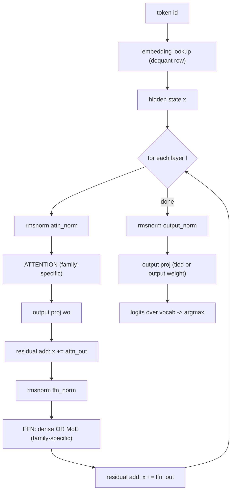
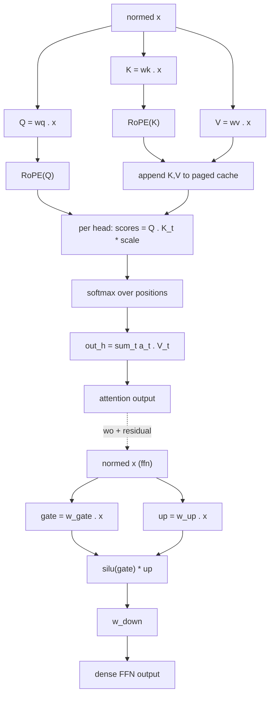
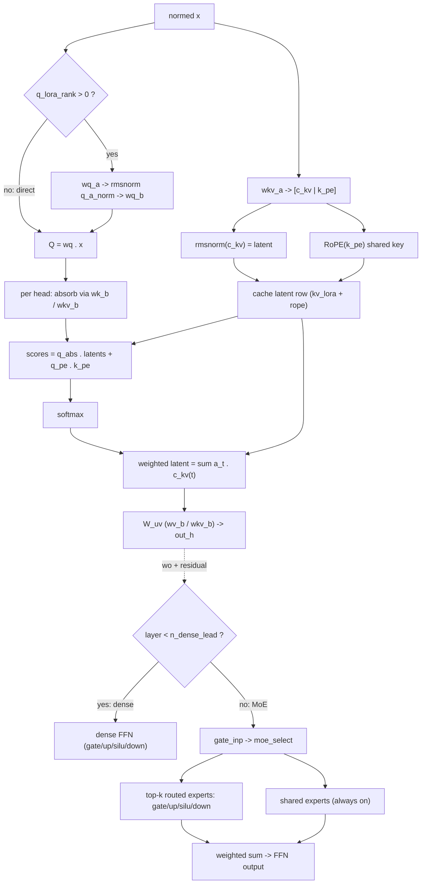
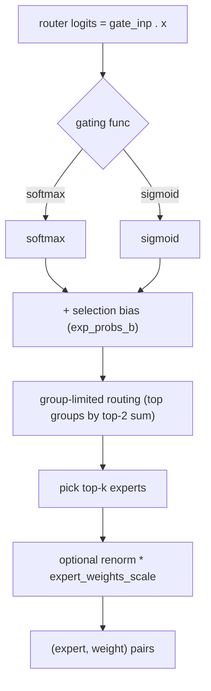
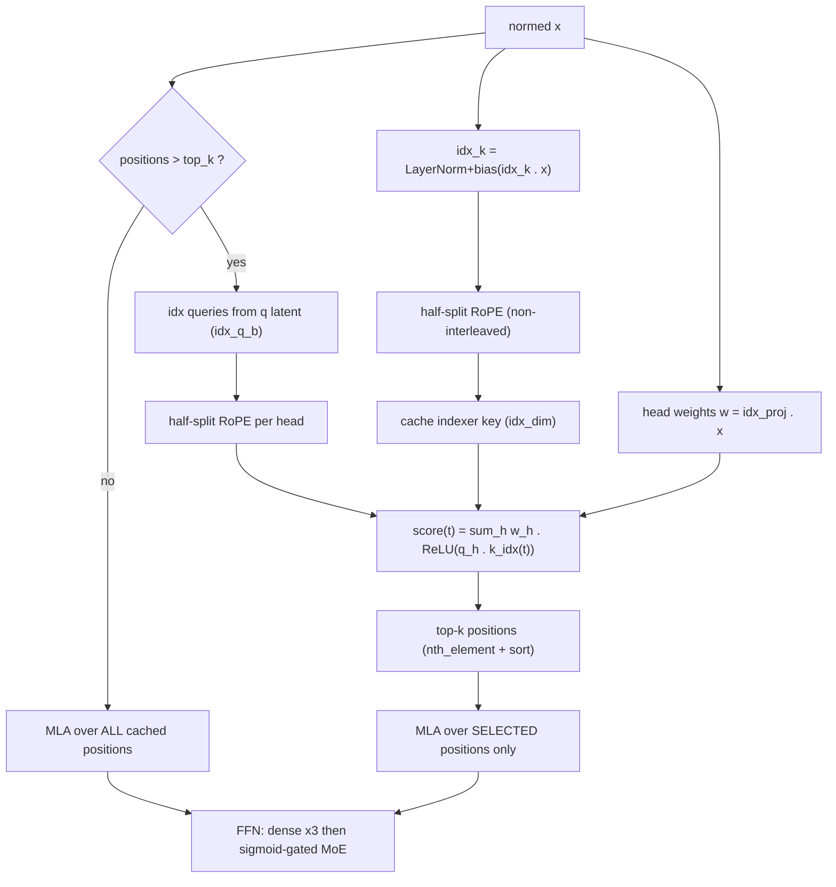

# Test-model architectures and information flow

Information-flow diagrams for every model under `tests/models/`.
The six model files map onto three architecture families the
runtime implements (`src/locus/model/arch.cpp`): `llama`,
`deepseek2`, and `glm-dsa`. Diagrams are per family; the
inventory below maps each file to its family and the spec that
drives its forward pass.

## 1. Inventory

| Model file            | Arch      | Quant  | Layers    | Attn        | FFN            |
|-----------------------|-----------|--------|-----------|-------------|----------------|
| stories260K           | llama     | F32    | 5         | MHA 8       | dense          |
| llama-3.2-1b-q8_0     | llama     | Q8_0   | 16        | GQA 32/8    | dense          |
| llama-3.2-1b-q4_k_m   | llama     | Q4_K_M | 16        | GQA 32/8    | dense          |
| deepseek-v2-lite      | deepseek2 | Q4_K_M | 27        | MLA 16      | 1d, MoE 64/6+2s |
| moonlight-16b-a3b     | deepseek2 | Q4_K_M | 27        | MLA 16/1    | 1d, MoE 64/6+2s |
| glm-5.2-iq1s          | glm-dsa   | IQ1_S  | 79 (78+1) | MLA+DSA 64/1 | 3d, MoE 256/8+1s |

Attn column: MHA/GQA/MLA with `heads` or `heads/kv_heads`. FFN
column: `Nd` = N leading dense layers, `MoE E/U+Ss` = E experts,
U routed per token, S always-on shared experts.

Key differences that change the diagrams:

- llama uses materialized-KV attention (MHA or GQA); deepseek2
  and glm-dsa use MLA latent attention (one compressed row per
  token in the cache).
- deepseek-v2-lite gates experts with softmax; moonlight and
  GLM-5.2 gate with sigmoid + group-limited routing.
- Only glm-dsa runs the DSA lightning indexer; the trailing MTP
  block (layer 78) is loaded but excluded from the causal stack,
  matching llama.cpp.

## 2. Shared forward skeleton

Every model is the same outer loop; the family only changes what
happens inside the Attention and FFN blocks.



## 3. llama family

Models: stories260K, llama-3.2-1b (Q8_0 and Q4_K_M).
Dense FFN; attention is multi-head, with grouped KV (GQA) when
`head_count_kv < head_count` (llama-3.2 is 32/8, stories260K is
8/8 = plain MHA). RoPE is the interleaved-pair variant; llama-3.2
carries a large rope base (500000) and optional llama3 scaling
divisors.



## 4. deepseek2 family (MLA + DeepSeek MoE)

Models: deepseek-v2-lite, moonlight-16b-a3b. MLA weight-absorbed
attention caches one latent row (rms-normed compressed KV plus a
shared roped key) per token instead of full K/V heads. FFN is
dense for the leading layer(s) then DeepSeek MoE (routed experts
+ always-on shared experts). deepseek-v2-lite uses softmax
gating; moonlight uses sigmoid gating.



MoE routing (`moe_select`, shared by CPU and GPU):



## 5. glm-dsa (MLA + DeepSeek MoE + DSA indexer)

Model: GLM-5.2 (744B, UD-IQ1_S). Computationally the deepseek2
stack (MLA + q_lora + split k_b/v_b, sigmoid gating, 256 experts
/ 8 used / 1 shared, 3 dense-lead layers, rope base 8e6) with one
addition: the DSA lightning indexer selects which cached
positions MLA attends. Below `indexer.top_k` (2048) positions the
selection keeps everything and the layer is identical to dense
MLA (this is what the llama.cpp golden anchors); beyond it, only
the top-k scored positions are attended. The trailing MTP block
(layer 78) is excluded from the causal stack.



## 6. Attention families at a glance

```
llama (MHA/GQA)      deepseek2 / glm-dsa (MLA)
-----------------    -------------------------------
cache: K,V per head  cache: 1 latent row per token
  (kv_heads * head_    (kv_lora + rope; glm-dsa adds
   dim, 2 tensors)      idx_dim for the indexer key)
scores: Q . K        scores: absorbed q . latents
                       + q_pe . k_pe
value: sum a . V     value: W_uv (sum a . c_kv)
select: all past     select: all past (deepseek2) or
                       DSA top-k (glm-dsa > top_k)
```

## 7. Where the diagrams live in code

| Stage                | Source                                        |
|----------------------|-----------------------------------------------|
| outer forward loop   | `LlamaModel::forward` (llama.cpp)             |
| llama attention      | `llama_attention` (arch.cpp)                  |
| MLA attention core   | `mla_attention` (arch.cpp)                    |
| deepseek2 attention  | `deepseek2_attention` -> mla_attention        |
| glm-dsa attention    | `glm_dsa_attention` (indexer + mla_attention) |
| dense / MoE FFN      | `LlamaModel::forward` / `moe_ffn` (llama.cpp) |
| expert routing       | `moe_select` (llama.cpp)                       |

The rest of this file is a glossary for a reader comfortable with
linear algebra but new to transformer internals. Notation: x in
R^d is a column vector, W in R^{m x n} a matrix, W.x the matvec,
<a,b> the dot product, `*` a scalar/elementwise product, `.` also
used as "apply matrix". A "token" is one input symbol; a
"position" is its index in the sequence.

## 8. Quantization

A weight tensor is a real matrix W in R^{m x n} learned in F32.
Quantization stores each entry in fewer bits as a low-precision
integer plus one or more shared scales, trading rounding error
for size. The headline number is bits-per-weight (bpw). All
schemes below dequantize back to F32 (an affine or table map)
before the matvec, unless a kernel does the integer dot directly.

| Scheme | bpw   | Encoding                                       |
|--------|-------|------------------------------------------------|
| F32    | 32    | IEEE-754 single. The reference; no quantizing. |
| F16    | 16    | IEEE-754 half. Same values, ~3 decimal digits. |
| Q8_0   | ~8.5  | Blocks of 32: one F16 scale d, int8 q per      |
|        |       | weight; w = d * q. Symmetric, near-lossless.   |
| Q4_K_M | ~4.5  | K-quant: super-blocks of 256, 4-bit weights,   |
|        |       | 6-bit per-sub-block (scale,min) over an F16     |
|        |       | super scale; w = d_sub*q + m_sub. "_M" keeps a  |
|        |       | few sensitive tensors higher -> mixed precision.|
| IQ1_S  | ~1.56 | Importance-aware: each block's weights are an   |
|        |       | index into a fixed sign/magnitude codebook fit  |
|        |       | to the weight distribution, times a per-block   |
|        |       | scale. ~20x smaller than F32 -- how 744B params |
|        |       | fit in 203 GB. Heavy rounding, codebook-viable. |

The trend: fewer bpw = smaller file, coarser rounding. Q8_0 is
essentially lossless; Q4_K_M is the usual quality/size sweet
spot; IQ1_S is aggressive and only works because the codebook is
fit to the actual weights.

## 9. What each diagram box computes

For x in R^d the per-layer state and W_* learned matrices:

- embedding lookup (dequant row): row t of the embedding matrix
  E in R^{V x d}, dequantized to F32. Maps a token id to E_t in
  R^d.
- hidden state x: the "residual stream" vector in R^d carried
  through every layer; each block reads a normalized copy and
  adds its result back.
- rmsnorm (attn_norm / ffn_norm / output_norm): root-mean-square
  normalization, y_i = x_i / sqrt(mean_j x_j^2 + eps) * g_i, with
  g a learned diagonal gain. Rescales x to unit RMS; no
  mean-centering (that is the difference from LayerNorm).
- ATTENTION: the only sequence-mixing operator -- produces a
  context vector as a softmax-weighted average over past tokens
  (per-family math in sections 3-5). Everything else is
  position-wise.
- output proj wo: linear map W_o applied to the concatenated
  per-head attention outputs, back to R^d.
- residual add: x <- x + sublayer(rmsnorm(x)). The skip
  connection; makes each block an identity-plus-perturbation.
- FFN (dense): position-wise gated MLP (SwiGLU),
  down( silu(W_gate.x) * (W_up.x) ), applied to each token
  independently. silu(z) = z * sigmoid(z).
- FFN (MoE): same MLP shape, but the (gate,up,down) matrices are
  chosen per token from a bank of experts (section on routing).
- output proj (tied or output.weight): final linear map
  R^d -> R^V to vocabulary logits; "tied" reuses E^T when there
  is no separate output matrix.
- logits -> argmax: z in R^V; greedy decoding emits argmax_i z_i.

llama attention:

- Q=wq.x, K=wk.x, V=wv.x: linear projections into per-head query,
  key, value subspaces.
- RoPE(Q)/RoPE(K): rotary position embedding -- rotate 2D
  coordinate pairs of Q,K by angle theta proportional to
  position * frequency. Encodes RELATIVE position because
  R(theta_a)^T R(theta_b) depends only on b - a.
- append K,V to paged cache: store this token's K,V so later
  tokens can attend to it.
- scores = Q.K_t * scale: inner products <q, k_t> over past t,
  scaled by 1/sqrt(head_dim).
- softmax over positions: a = exp(s) / sum exp(s), a probability
  vector over past positions.
- out_h = sum_t a_t * V_t: convex combination of past values.

deepseek2 / MLA attention:

- q_lora branch: low-rank query, x -> wq_a (down to rank r) ->
  rmsnorm -> wq_b (up). A factored W_q = wq_b.wq_a.
- wkv_a -> [c_kv | k_pe]: one projection yielding a compressed
  KV latent c_kv in R^{kv_lora} and a shared rotary key k_pe.
- rmsnorm(c_kv) = latent; RoPE(k_pe): normalize the latent,
  position-encode the shared key.
- cache latent row: store [normalized c_kv | roped k_pe] -- one
  vector per token instead of full per-head K,V (the MLA memory
  win).
- absorb via wk_b/wkv_b: weight absorption -- precompute
  q_abs = W_uk^T q so scores run directly against the latent,
  never materializing per-head K.
- scores = q_abs.latents + q_pe.k_pe: split inner product,
  compressed part plus rotary part.
- weighted latent = sum_t a_t * c_kv(t): average in latent space.
- W_uv -> out_h: decompress the averaged latent to the output
  space.

MoE routing:

- router logits = gate_inp.x: score every expert, r in R^E.
- softmax / sigmoid: map logits to gate weights (normalized
  across experts, vs independent per expert).
- + selection bias (exp_probs_b): additive per-expert bias used
  only to SELECT experts, not to weight their outputs.
- group-limited routing: partition experts into groups, keep the
  top groups (ranked by sum of each group's top-2 scores), select
  within them -- bounds how many groups a token touches.
- pick top-k experts: keep the k highest-scoring.
- optional renorm * expert_weights_scale: renormalize kept
  weights to sum 1, times a constant.
- (expert, weight) pairs: the sparse mixture applied to outputs.

glm-dsa indexer:

- idx_k = LayerNorm+bias(idx_k.x): the per-position indexer key.
  LayerNorm here (mean-centered), unlike the rmsnorm elsewhere.
- half-split RoPE (non-interleaved): rotary on the (i, i+d/2)
  pairing rather than adjacent (2i, 2i+1) pairs.
- cache indexer key: store it to score future queries.
- idx queries from q latent (idx_q_b): per-head indexer queries
  off the shared query latent.
- head weights w = idx_proj.x: a scalar weight per indexer head.
- score(t) = sum_h w_h * ReLU(<q_h, k_idx(t)>): head-weighted,
  rectified relevance of past position t.
- top-k positions: select top_k by score (nth_element, then sort
  to keep positions ascending).
- MLA over selected: run MLA restricted to those positions.

## 10. Acronyms

| Term     | Expansion                | One line                         |
|----------|--------------------------|----------------------------------|
| MHA      | Multi-Head Attention     | h independent Q/K/V subspaces    |
| GQA      | Grouped-Query Attention  | query heads share a K/V head     |
| MLA      | Multi-head Latent Attn   | cache a low-rank latent, not K/V |
| DSA      | DeepSeek Sparse Attn     | attend a selected position subset|
| MoE      | Mixture of Experts       | per-token choice of FFN weights  |
| FFN/MLP  | Feed-Forward / perceptron| the position-wise sublayer       |
| KV       | Key / Value              | the tensors attention caches     |
| RoPE     | Rotary Position Embedding| position via coordinate rotation |
| RMSNorm  | Root-Mean-Square Norm    | scale to unit RMS, learned gain  |
| LayerNorm| Layer Normalization      | mean-center then scale           |
| SwiGLU   | Swish-Gated Linear Unit  | silu(gate) * up MLP              |
| SiLU     | Sigmoid Linear Unit      | silu(z) = z * sigmoid(z)         |
| ReLU     | Rectified Linear Unit    | max(0, z)                        |
| LoRA     | Low-Rank Adaptation      | W as a product of two thin mats  |
| MTP      | Multi-Token Prediction   | the extra nextn block            |
| GGUF     | (model container format) | the on-disk weights + metadata   |
| bpw      | bits per weight          | quantization density             |
| eps      | epsilon                  | small constant for stability     |

## 11. Concepts

- Residual stream: x in R^d threaded through all layers; each
  sublayer adds sublayer(rmsnorm(x)). The network is a sum of
  contributions (identity + perturbation), which is what lets it
  go deep without vanishing signal.
- Materialized-KV attention (MHA / GQA): the classic form --
  cache the full key K_t and value V_t per token; scores are
  <q, k_t>, output sum softmax_t * V_t. GQA shares one K/V head
  across a group of query heads, shrinking the cache by the group
  factor with almost no quality loss.
- MLA latent attention: cache one compressed c_kv in R^{kv_lora}
  per token plus a shared rotary key, instead of per-head K,V.
  Weight absorption rewrites <q, k> as <W_uk^T q, c_kv>, so
  per-head K is never formed; the value is recovered by W_uv on
  the averaged latent. ~order-of-magnitude smaller cache for a
  little extra compute.
- Weight absorption: the identity q^T (W_uk c) = (W_uk^T q)^T c.
  Precomputing W_uk^T q makes scores a dot against the latent.
- Mixture of Experts: the FFN matrices are one of E banks; a
  router picks k per token; output is sum_e w_e * FFN_e(x). Grows
  parameter count without growing per-token FLOPs (only k of E
  run). Shared experts always run; routed experts are selected.
- Group-limited routing: confine a token's routing to a few
  expert groups, bounding the working set -- and, when streaming
  weights from disk, the bytes read per token.
- Leading dense layers: the first n blocks use a plain dense FFN;
  routing begins only after them (n_dense_lead).
- RoPE interleaved vs half-split: same rotation math, different
  pairing of the coordinates it rotates -- adjacent (2i,2i+1) vs
  (i, i+d/2). Must match training; llama uses interleaved, the
  DSA indexer uses half-split.
- DSA lightning indexer: a cheap auxiliary scorer. Once the
  context exceeds top_k it ranks past positions by
  sum_h w_h ReLU(<q_h, k_idx>) and lets MLA attend only the top_k
  -- O(top_k) instead of O(n) beyond the cap, at the cost of the
  indexer projections. Below top_k it selects everything, so it
  is exactly dense (which is why the sub-2048 golden validates
  the whole path).
- Multi-token prediction (MTP / nextn): an extra block trained to
  predict the token after next (a speculative-decoding aid). Not
  part of the causal forward, so locus loads but excludes it.
- Tied embeddings: reuse E as E^T for the output projection when
  the model ships no separate output.weight.
- Paged KV cache: the K/V (or MLA latent) store is allocated in
  fixed-size blocks (pages), so many sequences share one pool and
  common prefixes can be shared instead of copied.
